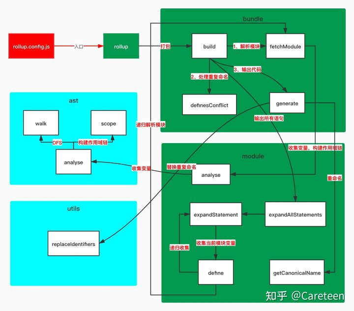

原文链接:[rollup - 构建原理及简易实现 - 掘金 (juejin.cn)](https://juejin.cn/post/6971970604010307620#heading-11)

# 源码结构

```
│  bundle.js // Bundle 打包器，在打包过程中会生成一个 bundle 实例，用于收集其他模块的代码，最后再将收集的代码打包到一起。
│  external-module.js // ExternalModule 外部模块，例如引入了 'path' 模块，就会生成一个 ExternalModule 实例。
│  module.js // Module 模块，module 实例。
│  rollup.js // rollup 函数，一切的开始，调用它进行打包。
│
├─ast // ast 目录，包含了和 AST 相关的类和函数
│      analyse.js // 主要用于分析 AST 节点的作用域和依赖项。
│      Scope.js // 在分析 AST 节点时为每一个节点生成对应的 Scope 实例，主要是记录每个 AST 节点对应的作用域。
│      walk.js // walk 就是递归调用 AST 节点进行分析。
│
├─finalisers
│      cjs.js
│      index.js
│
└─utils // 一些帮助函数
        map-helpers.js
        object.js
        promise.js
        replaceIdentifiers.js
```

# 构建流程

## 变量解释

```js
class Scope {
	constructor(options = {}) {
    this.name = options.name
    this.parent = options.parent
    this.names = options.params || []
  }
}
```


```js
class Bundle 
{
  constructor(options){
  this.entryPath
  this.modules={} //存放所有模块 入口文件 和 它依赖的模块    
  }
//所有分析标记之后返回的数组    
 statements     
    
  build(outputFileName){}
  fetchModule(importee,importer) 
}
```


```js
class module
    {
        imports:{ 'localname':{name,localName,source} },
		exports:{ 'name':{node,name,expression } },
		
    }

_defines (存放当前模块定义的所有的全局变量)
_dependsOn (当前模块没有定义但是使用到的变量)
definitions (存放全局变量的定义语句)

//(找到当前节点依赖的变量,这些变量的声明语句)
 node [] = expandStatement(statement)    
// (找到定义这个变量声明节点)	
define（name）
```

## 使用demo

```js
const path= require('path')
const rollup=require('./lib/rollup')
//入口绝对路径
let entry=path.resolve(__dirname,'src/main.js')
```


## 1 new Bundle(),build()

```js
let Bundle=require('./bundle')
function rollup(entry,outputFileName) {
    const bundle = new Bundle( {entry} )
    bundle.build(outputFileName)
}
```

## 2 analyse函数

- 收集导入和导出变量
- 建立映射关系，方便后续使用
- 收集所有语句定义的变量
- 建立变量和声明语句之间的对应关系，方便后续使用
- 过滤import语句
- 删除关键词
- 输出语句时,判断变量是否为import
- 是递归收集依赖文件的变量
- 否直接输出
- 构建依赖关系，创建作用域链，交给 ./src/ast/analyse.js 文件处理
- 抽象语法树每条语句挂在`_source`、`-defines` 、`-dependsOn`(外部依赖的变量)、`-included`（是否已经包含在输出语句中）
- 收集每个语句上定义的变量，创建作用域链

## 3 generate

第一步: 移除额外代码 ，export function foo(){}   移除export

第二步: AST节点的源码addSource到 magicString 

```js
let bundleString=new MagicString.Bundle()
bundleString.addSource({
 content:'console.log(hello)',
 separator:'\n'
})
bundleString.addSource({
 content:'console.log(world)',
 separator:'\n'
})
```

第三步: 返回合并源代码

```js
return magicString.toString()
```



